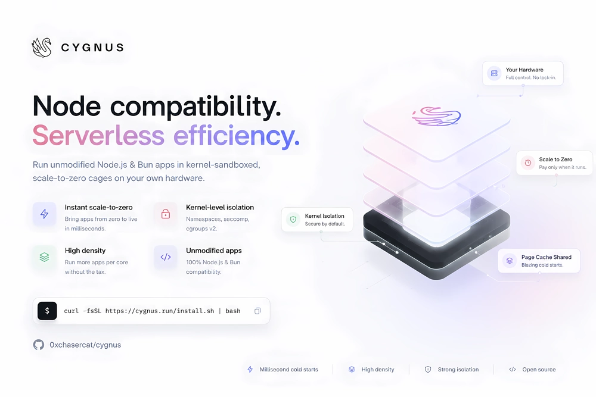

<p align="center">
  
</p>

# Cygnus

Self-hosted serverless for Bun and Node apps. One binary, no containers, no
registry, no YAML. Deploy unmodified apps into kernel-sandboxed cages that
scale to zero and revive in tens of milliseconds.

V8-isolate platforms (Workers, Deno Deploy) got fast cold starts by dropping
Node compatibility — no native addons, no arbitrary `fs`, no long-lived
processes. Container platforms kept compatibility but paid for it with slow
cold starts, image pulls, and per-container overhead. Cygnus runs full
Bun/Node instead, sandboxed with the same kernel primitives Docker itself is
built on — namespaces, seccomp, cgroups v2 — skipping the container image
and registry layer entirely. A cage boots from a bundled artifact already
sitting in the page cache, not from a pulled image.

A cage is a warm per-app **server**, not a function instance: it handles
concurrent requests, holds WebSocket/SSE connections open, and keeps
in-memory state between requests. Idle apps scale to zero and cost disk
only; the next request revives them.

## Install

**Linux** (kernel 5.15+, systemd, root):

```sh
curl -fsSL https://raw.githubusercontent.com/0xchasercat/cygnus/main/install.sh | sudo bash
```

**macOS** (development, your user, everything under `~/.cygnus`, no sudo):

```sh
curl -fsSL https://raw.githubusercontent.com/0xchasercat/cygnus/main/install.sh | bash
```

macOS runs cages as plain processes — no namespaces, no cgroups, no seccomp.
It's fine for local development; it isn't the isolation story on Linux.

The installer downloads the latest release, verifies checksums, starts the
daemon, and prints your console URL plus a one-time **recovery token**. Save
that token somewhere safe — it's shown exactly once and it's your only way
back in if you ever lose the admin password. Open the console URL and the
setup wizard walks you through creating the admin account (email +
password) on first visit; you won't need the token unless you get locked
out later, at which point you can regenerate it with
`install.sh --rotate-secrets`.

Everything after install is configured from the dashboard: listen address,
custom domains, ACME/HTTPS, DNS provider. Flags exist to set them at install
time too (`--apps-domain`, `--https-listen`, `--acme-email`, ...); run
`install.sh --help` for the full list.

Re-running the installer upgrades in place — binaries, engine, and console
always track the release you point it at; config and the systemd/launchd
service file only change with `--reconfigure`; secrets only rotate with
`--rotate-secrets`. To remove Cygnus entirely (stops the service, deletes
binaries, config, state, and runtime sockets — this is destructive and does
not touch anything outside its own directories):

```sh
install.sh --uninstall
```

## Deploy

Three ways in:

- **Dashboard** — upload a folder or connect a GitHub repository; watch the
  build stream live and the app go active. Set environment variables and
  toggle a preview deploy (isolated app + domain) from the same modal.
- **Git push** — the console creates a GitHub App for your account; pushes
  to a configured branch build and deploy automatically, pull requests get
  preview deployments with their own domain.
- **CLI** — run `cygnus deploy` from inside a project directory and it infers
  the app name from the folder; pass `--app`, `--domain`, `--env KEY=VALUE`
  (repeatable), or `--preview <slug>` to override. The build streams to your
  terminal and prints the live URL.

Builds always run server-side in a locked-down build cage: frozen installs
(`bun install --frozen-lockfile`, so commit your lockfile), lifecycle
scripts disabled, egress limited to the package registry. The build produces
a content-addressed artifact — bundled source plus JSC bytecode — that boots
straight from the page cache on revival, skipping the parse phase entirely.

## How it works

```text
[ client HTTP/HTTPS ]
        |
[ cygnus daemon — one Rust binary, root ]
  ├─ TLS termination (rustls) + ACME
  ├─ Host routing (lock-free reads)
  ├─ request logs · metrics · per-app limits
  ├─ cage supervisor (boot, drain, reap, crash backoff)
  └─ admin API (root-only UDS) + Tenant 0 bridge
        |  HTTP/1.1 over per-app unix sockets
[ cage: userns · mntns · pidns · netns · cgroups v2 · seccomp ]
  └─ bun --preload shim.js bundle.js   (bytecode artifact, RO mount)
```

- The daemon is the only privileged process on the box. Cages hold no TLS
  certs, no admin capability, no host mounts — a compromised app can't touch
  its neighbors or the control plane.
- Apps need zero code changes. A preloaded shim redirects `Bun.serve`,
  `node:http`, and legacy `app.listen(3000)` patterns onto the cage's unix
  socket, so unmodified Express/Fastify/Bun.serve apps just work.
- Egress is real networking (veth + nftables), not a userspace proxy: native
  DB drivers, raw TCP, arbitrary outbound TLS all work. SSRF containment is
  the default policy — no cloud metadata service, no cage-to-cage traffic,
  no RFC1918 ranges reachable from a tenant app.
- Deploys are blue-green with instant rollback (compare-and-swap on the
  active artifact); the last several sealed artifacts stay on disk so a
  rollback never triggers a rebuild.
- The dashboard (`tenant-0`) is itself a caged Cygnus app, talking to the
  daemon over a typed admin protocol rather than a raw shell. If a bad
  dashboard deploy bricks the dashboard, `cygnus` on the host talks to the
  same daemon over a root-only socket and isn't affected.
- All platform state — apps, deployments, domains, encrypted env vars, audit
  log — lives in one SQLite database. `scp` the state dir and the binaries
  and you have a working backup.

## DNS

Apps get subdomains of your configured apps domain. Point a wildcard record
at the host:

```
*.apps.example.com  A  <host-ip>
```

`apps.localhost` works out of the box for local use — browsers resolve
`*.localhost` to loopback without any DNS setup.

## The console

The dashboard streams build logs live, charts request latency and cold-start
timing breakdowns from the daemon's own telemetry (never self-reported by
the app process), and manages domains, environment variables, GitHub
repositories, and rollbacks. It's served by the platform itself as app
`tenant-0`, running under the same isolation as every other app on the node.

## CLI

```
cygnus status                 node, engines, certificates
cygnus apps                   registered apps and their cages
cygnus deploy                 server-side build, streamed, infers app from cwd
cygnus logs <deployment>      build output
cygnus rollback <app> <dep>   instant blue-green rollback
```

Run `cygnus <command> --help` for the full flag list on any subcommand.

## Operate

- **Idle timeout** — apps reap after 10 minutes idle by default (configurable
  per app) and cost disk only while asleep. Set `min_instances: 1` to keep
  an app always warm.
- **Where things live** (Linux paths shown; macOS mirrors under `~/.cygnus`):

  | Path | What |
  |---|---|
  | `/var/lib/cygnus/state.db` | all platform state (SQLite) |
  | `/var/lib/cygnus/artifacts` | content-addressed build artifacts |
  | `/var/lib/cygnus/logs` | build and app logs |
  | `/run/cygnus/admin.sock` | root-only admin socket (break-glass) |
  | `/etc/cygnus` | node config and non-secret env |

- **Troubleshooting**
  - Console unreachable: `systemctl status cygnus`, then
    `journalctl -u cygnus -n 100`.
  - App returning 502/503: the daemon's log line explains why the cage
    failed to boot; `cygnus logs <deployment>` shows the build output.
  - Locked out (lost the admin password): sign in with the recovery token
    from install, or regenerate it with `install.sh --rotate-secrets`.

## Building from source

```sh
cargo build --release            # daemon, CLI, init
cd console && bun install && bun run build   # dashboard
cargo test --workspace           # unit + integration (cage tests need Linux)
```

The workspace builds and tests on macOS; the full isolation stack (namespaces,
seccomp, cgroups v2) needs Linux 5.15+.

## Documentation

- [Getting started](docs/getting-started.md) — a longer walkthrough of the
  same install → deploy → operate flow above.

## License

[AGPL-3.0](LICENSE)
